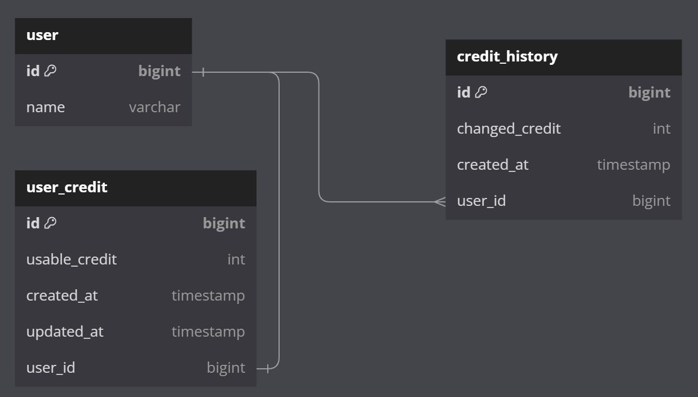

# 🪙 크레딧 서버

## 기능

1. 사용자별 크레딧 잔량 조회
2. 사용자의 크레딧 차감
3. 매일 자정 크레딧 사용량 초기화

## 구현 방향

### 크레딧 조회 시 총량을 계산 (v1)

#### ERD

#### 동작 흐름

1. 크레딧 차감
   1. 크레딧 차감 내역(`credit_history`) 데이터 생성
2. 크레딧 조회
   1. 크레딧 차감 내역(`credit_history`)에서 해당 날짜의 크레딧 차감량 총합을 구해 총 제공 크레딧과 뺄셈 연산
3. 크레딧 갱신
   1. 조회 시 당일의 데이터만 조회하므로, 별도 갱신 작업이 필요 없음

### 총량을 저장하고 차감 시 업데이트 (v2)

#### ERD

#### 동작 흐름

1. 크레딧 차감
   1. 트랜잭션 시작 
   2. 크레딧 차감 내역(`credit_history`) 데이터 생성
   3. 사용자의 크레딧 소유량(`user_credit`)을 차감하여 업데이트
   4. 트랜잭션 커밋
2. 크레딧 조회
    1. user_credit을 조회하여 남은 크레딧량을 반환
3. 크레딧 갱신
   1. 매일 자정에 배치로 모든 사용자의 크레딧 소유량을 초기화

## 성능 비교

### 예상

트래픽이 적을 때에는 성능이 유사하나, 트래픽이 많아지면 v2가 v1보다 더 많은 요청에 대응할 수 있을 것이다. 

### 테스트 환경

- CPU: 12 Core
- Memory: 16 GB
- 단일 머신에서 도커 컨테이너로 자원을 격리하여 실행
- 각 서버별 할당 자원은 아래와 같음

   |  | **Application Server** | **DB Server** | **K6 Server** | **Total** |
   | --- | --- | --- | --- | --- |
   | **CPU Core** | 2 | 2 | 2 | 6 |
   | **Memory** | 4 (0~3) | 4 (4~7) | 2 (8~9) | 10 |

### 테스트 결과
